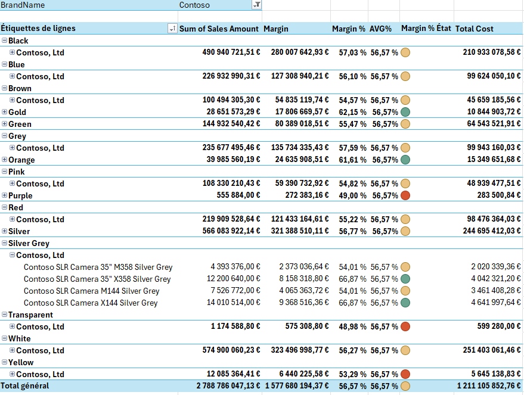
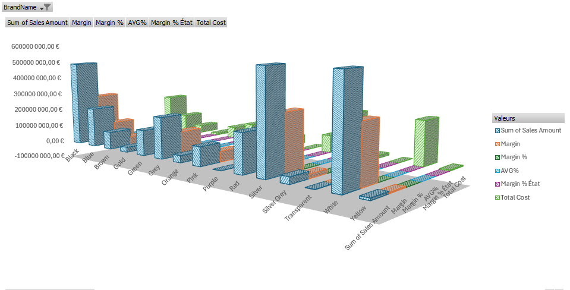
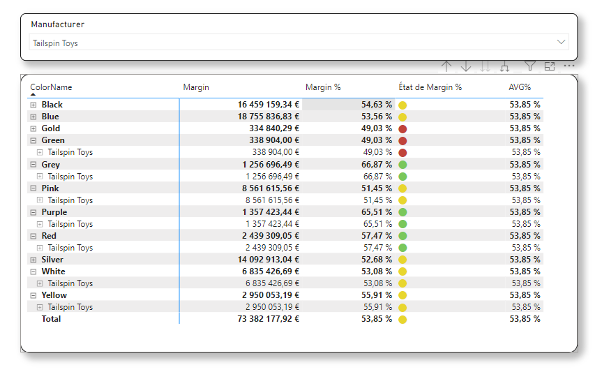
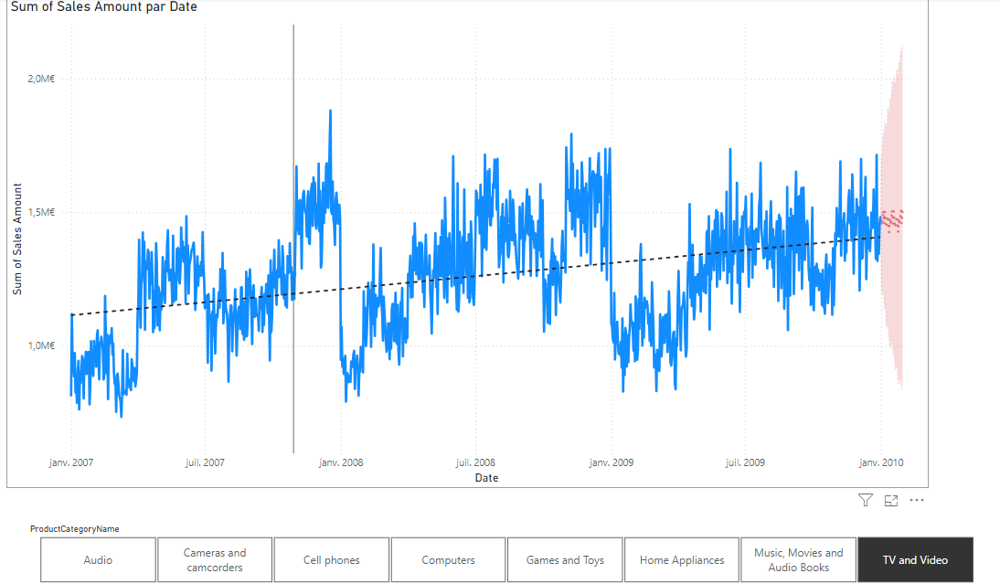
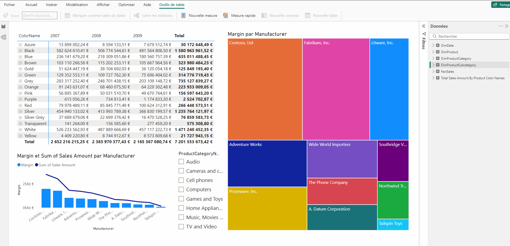

- [Introduction](#introduction)
- [Modèle Tabulaire](#modèle-tabulaire)
- [Excel](#excel)
  - [Pivot Table](#pivot-table)
  - [Histogramme](#histogramme)
- [PowerBI](#powerbi)
  - [Visuel 1](#visuel-1)
  - [Visuel 2](#visuel-2)
  - [Animation](#animation)
- [Conclusion](#conclusion)

-[Conclusion](#conclusion)

## Introduction

*Ceci est un projet d'analyse de données avec SSAS, Excel et PowerBI, basé sur la base de données Contoso.*

## Modèle Tabulaire

## Excel
Voici deux visuels avec Excel
### Pivot Table

### Histogramme

## PowerBI
Voici deux visuels avec PowerBI
### Visuel 1

### Visuel 2

### Animation

## Conclusion
